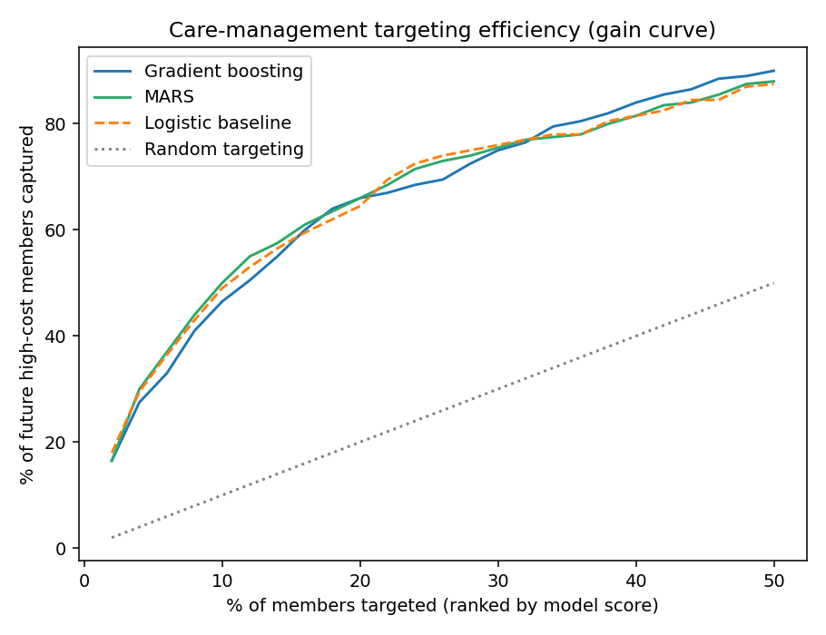

# Payer Claims Analytics — High-Cost Member Prediction

**End-to-end healthcare payer data science project: synthetic claims data → SDOH-enriched features → high-cost member prediction → HEDIS-inspired quality measures → stakeholder insights report.**

> **In one breath:** Built an end-to-end healthcare payer ML pipeline that predicts next-year high-cost members from claims, clinical, and social-determinants data, achieving 0.83 AUC and capturing 66% of future high-cost members while targeting only 20% of the population. Complemented risk prediction with HEDIS-inspired quality measures and a stakeholder insights report linking care-management targeting to CMS Star Ratings strategy.

This repo models the core analytics loop behind payer cost-of-care and population health work: prospectively identifying next year's high-cost members from this year's claims, and connecting that risk ranking to quality-measure gaps where cost and Star Ratings incentives align.

## Results at a glance

| | |
|---|---|
| Prediction task | Top-decile year-2 cost, from year-1 signals only |
| ROC-AUC (held-out) | 0.83 |
| Lift @ top 5% targeted | 6.1x base rate |
| High-cost members captured @ 20% targeted | 66% |

Full findings — including why the logistic baseline beats gradient boosting here and what that means for client recommendations — in **[reports/INSIGHTS.md](reports/INSIGHTS.md)**.



## Run it

```bash
pip install -r requirements.txt
python src/run_pipeline.py
```

One command regenerates everything: data (seeded, reproducible), features, model, figures, quality measures, and `reports/model_results.json`. Runtime ≈ 1 minute.

## Repo structure

```
src/
├── generate_data.py     # synthetic members, 2 years of claim lines, zip-level SDOH
├── features.py          # utilization, clinical burden, SDOH feature engineering
├── train_model.py       # baseline + GBM, lift/capture metrics, figures
├── quality_measures.py  # HEDIS-inspired measures (eligible pop → numerator → rate)
└── run_pipeline.py      # end-to-end orchestration
reports/
├── INSIGHTS.md          # stakeholder-facing findings & recommendations
├── model_results.json   # reproducible metrics
├── figures/             # ROC, feature importance, gain curve
└── quality_measures_*.csv
```

## Design choices worth noting

- **Prospective framing.** Features come exclusively from year 1; the target is year 2. No leakage, mirroring how care-management targeting actually deploys.
- **Business metrics over ML metrics.** Lift and capture at realistic targeting budgets (5–20%) are what determine program ROI; AUC is reported but doesn't drive the recommendation.
- **SDOH as a segmentation story.** Zip-level deprivation indices are integrated as features, and the insights report is explicit about where they do and don't add value.
- **Honest model selection.** The simpler baseline wins on this data, and the report says so — explainability matters when the audience is 